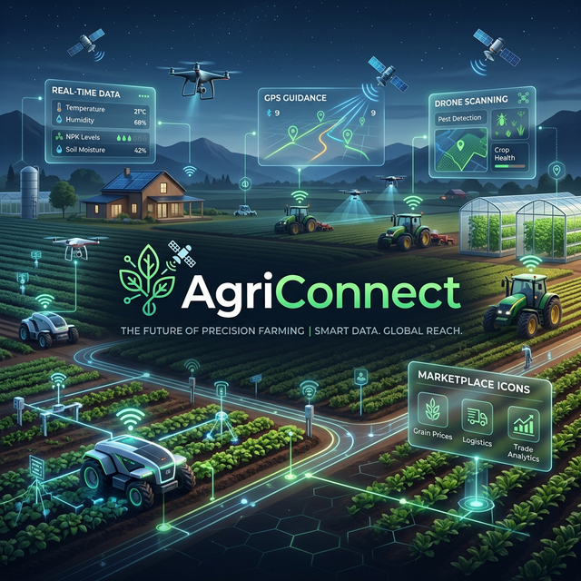

<div align="center">
  
  
  # AgriConnect: Revolutionizing the Agricultural Ecosystem
  
  [](https://opensource.org/licenses/MIT)
  [](https://reactjs.org/)
  [](https://nodejs.org/)
  [](https://prisma.io/)
  [](https://mysql.com/)

**A smart, data-driven platform bridging the gap between Farmers, Sellers, and Citizens for a sustainable food distribution future.**

</div>

---

## 📖 Table of Contents

- [Overview](#-overview)
- [Key Features](#-key-features)
  - [For Farmers](#for-farmers)
  - [For Market Sellers](#for-market-sellers)
  - [For Communities & PDS](#for-communities--pds)
- [Technical Architecture](#-technical-architecture)
- [Tech Stack](#-tech-stack)
- [Installation and Setup](#-installation-and-setup)
- [Future Roadmap](#-future-roadmap)
- [Contributing](#-contributing)
- [License](#-license)
- [Meet Team FoodChainX](#-meet-team-foodchainx)

---

## 🌎 Overview

**AgriConnect** is an advanced full-stack platform designed to optimize the agricultural supply chain and food distribution system. By leveraging **GPS tracking**, **Remote Sensing APIs**, and **Machine Learning recommendations**, we empower farmers with precise insights, facilitate direct peer-to-peer commerce, and streamline community-based resource distribution.

Our mission is simple: **Increase farmer yield, reduce market fragmentation, and ensure food security for all.**

---

## ✨ Key Features

### For Farmers

- **Precision Recommendations**: Intelligent AI-driven crop suggestions based on real-time remote sensing data, soil analysis, and regional market trends.
- **Optimal Planting Schedules**: Guidance on the ideal time to sow and harvest using satellite-based climate data.
- **Farming Best Practices**: Continuous access to modern agronomical insights tailored to specific land conditions.

### For Market Sellers

- **Direct Marketplace**: List produce with ease (image uploads, category tagging, competitive pricing) directly to the buyer network.
- **Eliminating Middlemen**: Bypassing traditional logistics overhead to ensure higher profit margins for producers.
- **Transparent Pricing**: Integration with future market data for better price discovery.

### For Communities & PDS

- **Smart PDS Integration**: Real-time alerts to citizens when essential rations (rice, wheat, pulses, etc.) are ready at their local distribution centers.
- **Accountability System**: Integrated escalation mechanism to report and resolve food distribution grievances instantly.
- **Community Distribution**: Tools for local organizations to manage and track resource allocation efficiently.

---

## 🏗 Technical Architecture

AgriConnect follows a modern, decoupled **MERN-variant** architecture:

- **Client Layer**: A responsive React SPA using modern hooks and context for state management.
- **Service Layer**: A high-performance Express/Node.js REST API layer.
- **Data Persistence**: MySQL database managed via **Prisma ORM** for type-safe database access and migrations.
- **Integration Layer**: Custom wrappers for GPS, Remote Sensing, and Market Analytics APIs.

---

## 💻 Tech Stack

- **Client**: 
- **Server**:  
- **ORM/DB**:  
- **Deployment & Tools**:  

---

## ⚙️ Installation and Setup

### Prerequisites

- Node.js (v18.x or higher)
- MySQL Server
- npm or yarn

### 1. Clone the Repository

```bash
git clone https://github.com/suvendukungfu/AgriConnect.git
cd AgriConnect
```

### 2. Frontend Configuration

```bash
cd client
npm install
npm start
```

### 3. Backend Configuration

```bash
cd ../server
npm install
```

Create a `.env` file in the `server/` directory and configure your database:

```env
DATABASE_URL="mysql://<username>:<password>@localhost:3306/agriconnect"
PORT=5000
```

### 4. Initialize Database

```bash
npx prisma migrate dev --name init
```

### 5. Start Backend Development

```bash
npm run dev
```

---

## 🚀 Future Roadmap

- [ ] **AI Yield Prediction**: Leveraging historical data for high-accuracy yield forecasting.
- [ ] **Blockchain Traceability**: Integrating Hyperledger/Ethereum for end-to-end produce tracking.
- [ ] **Multilingual Support**: Expanding platform accessibility to regional languages for non-English speaking farmers.
- [ ] **Real-time IoT Integration**: Hardware soil-sensor integration for live telemetry.

---

## 🤝 Contributing

We welcome contributions from the community!

1. Fork the repo.
2. Create your feature branch (`git checkout -b feature/AmazingFeature`).
3. Commit your changes (`git commit -m 'feat: add some amazing feature'`).
4. Push to the branch (`git push origin feature/AmazingFeature`).
5. Open a Pull Request.

---

## 📜 License

Distributed under the **MIT License**. See `LICENSE` for more information.

---

## 👨‍💻 Meet Team FoodChainX

- **Akash Dhar Dubey** - Project Lead & Architect
- **AgriConnect 2025** - Sustainable Tech Innovation Initiative

---

<div align="center">
  Made with ❤️ for Sustainable Agriculture
</div>
