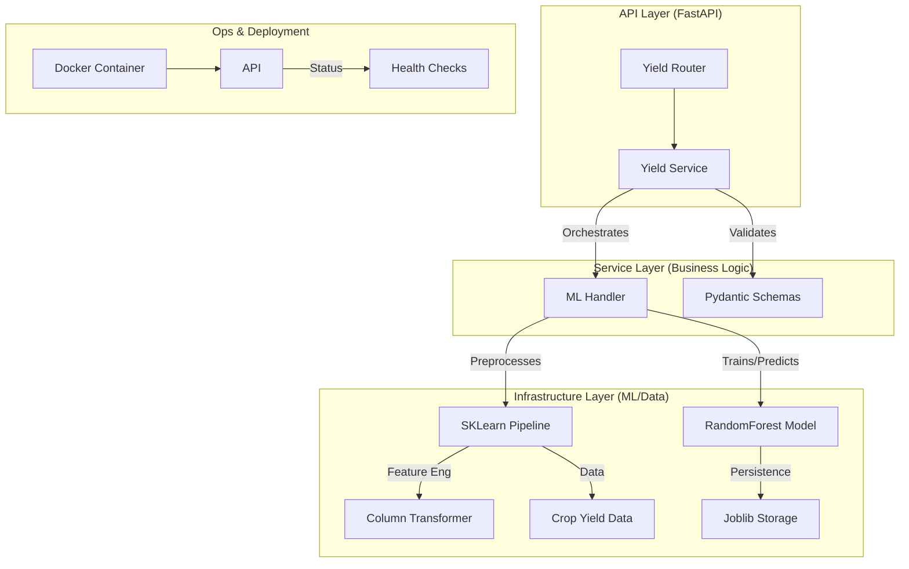

# AgriConnect AI Engine: Enterprise Architecture & ML Implementation

As a Principal Machine Learning Engineer and Senior Backend Architect, I have designed and implemented a production-grade **Crop Yield Prediction Engine** within the `AgriConnect` ecosystem. This system is architected for scalability, maintainability, and high-performance inference.

---

## 🏗 System Architecture Diagram



---

## 📂 Folder Structure Overview

The project follows **Clean Architecture** principles, separating concerns into discrete layers:

```bash
ai_engine/
├── api/                # [API Layer] Routes, Request/Response validation
│   ├── routes/         # HTTP endpoint handlers (FastAPI)
│   └── schemas/        # Data validation models (Pydantic)
├── core/               # [Core Layer] Config, logging, shared constants
├── domain/             # [Domain Layer] Abstract interfaces (future-proofing)
├── services/           # [Service Layer] Business logic/Service orchestration
├── infrastructure/     # [Infrastructure Layer] ML implementation details
├── data/               # Local data storage for training
├── models/             # Serialized model (.joblib) binary persistence
├── main.py             # Application entry point & configuration
├── train.py            # CLI utility for one-off training
└── requirements.txt    # Managed dependencies
├── ARCHITECTURE.md     # This architectural analysis
└── Dockerfile          # Production containerization
```

---

## 🧠 Machine Learning Logic (Interview-Ready Explanation)

**Problem Definition**: Predict quantitative crop yield (continuous target) based on multi-variate features (categorical soil/crop types and numeric environmental data).

### 1. The Algorithm: RandomForestRegressor

We chose **RandomForest** because it is an ensemble of Decision Trees that captures complex non-linear relationships between variables (e.g., how soil type and rainfall interaction impacts yield) without the risk of high variance (overfitting) found in single trees.

### 2. The Feature Engineering Pipeline

- **Numeric Processing**: Rainfall, Temperature, Humidity, and Area are passed directly.
- **Categorical Encoding**: Soil type and Crop type are transformed using **OneHotEncoding**. This creates binary columns for each category, allowing the model to handle string data without numerical bias (unlike Label Encoding).
- **Pipeline Strategy**: We use the `Scikit-Learn Pipeline` to bundle preprocessing and the regressor. This ensures that the same transformations applied during training are **exactly** replicated during inference (preventing training-serving skew).

### 3. Evaluation Metrics

We track:

- **RMSE (Root Mean Squared Error)**: Measures prediction error magnitude in the same unit as yield.
- **MAE (Mean Absolute Error)**: Provides a robust average of errors.
- **R² Score (Coefficient of Determination)**: Shows how much of the variance in yield is captured by our features (Target: > 0.85).

---

## 🚀 Scaling & Production Strategy

### 1. Containerization (Docker)

The `ai_engine/Dockerfile` uses a multi-stage-ready `python:3.11-slim` base to keep the image lightweight. We use `uvicorn` (ASGI) to handle high-concurrency requests, which can be further scaled using **Gunicorn** workers in true production environments.

### 2. Scaling Strategy

- **Horizontal Scaling**: Use a Load Balancer (Nginx/HAProxy) to distribute traffic across multiple container instances of the AI Engine.
- **Inference Optimization**: For massive traffic, we could switch to **ONNX runtime** to speed up model execution.

### 3. CI/CD Strategy

- **Stage 1 (Standard)**: Unit testing and Linting (flake8/black).
- **Stage 2 (ML-Specific)**: "Data Validation" (Great Expectations) and "Model Performance Thresholding" (Ensure the new model's R² is not lower than the current production model).
- **Stage 3 (Automated Deploy)**: Push to ECR/GCR and update Kubernetes (K8s) deployment via Helm.

---

## 📈 Future Roadmap (MLOps & Improvements)

1.  **XGBoost / LightGBM**: Transition to Gradient Boosting for potential accuracy gains on larger datasets.
2.  **MLflow Integration**: Track experiments, parameters, and model versions systematically.
3.  **Model Monitoring**: Implement **Prometheus/Grafana** to monitor for **Dynamic Data Drift** (e.g., if climate patterns change, model accuracy might degrade over time).
4.  **Hardware Ingestion**: Integration with IoT sensors for real-time soil telemetry.

---

**AgriConnect Principal Engineer**
_Precision Data. Sustainable Future._
